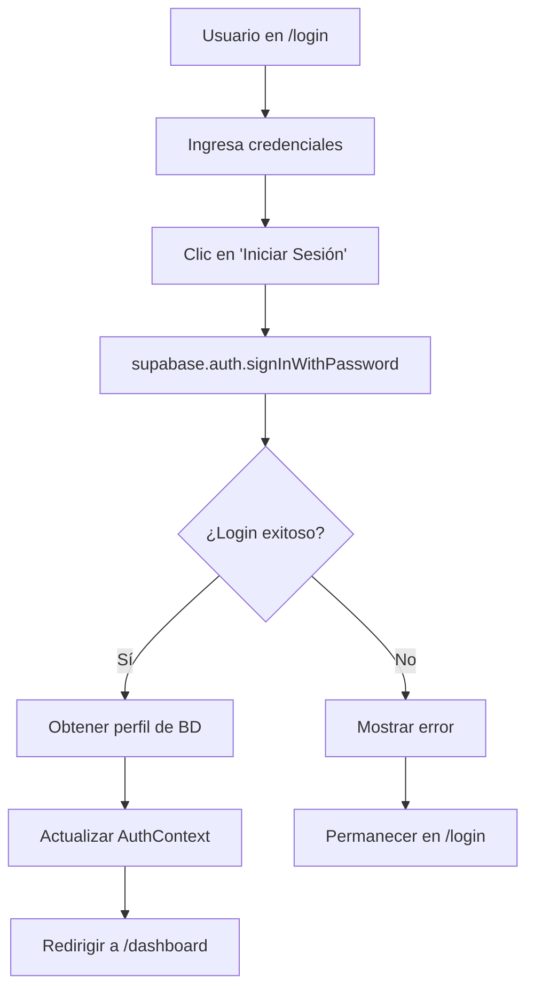
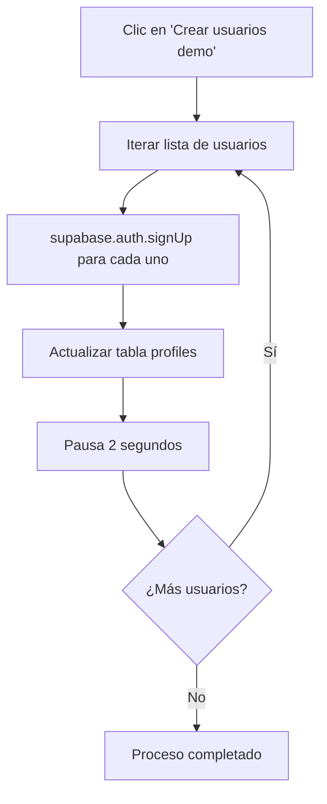

# 🗳️ MI CAMPAÑA 2025 - Documentación Técnica Completa

## 📋 Índice
1. [Resumen Ejecutivo](#resumen-ejecutivo)
2. [Arquitectura del Sistema](#arquitectura-del-sistema)
3. [Credenciales y Usuarios](#credenciales-y-usuarios)
4. [Base de Datos](#base-de-datos)
5. [Lógica de Autenticación](#lógica-de-autenticación)
6. [Flujo de Acceso](#flujo-de-acceso)
7. [Jerarquía de Roles](#jerarquía-de-roles)
8. [Troubleshooting](#troubleshooting)

---

## 1. 🎯 Resumen Ejecutivo

**MI CAMPAÑA 2025** es una plataforma de gestión electoral con estructura jerárquica que permite la administración de campañas políticas desde el nivel desarrollador hasta votantes individuales.

### Tecnologías Principales:
- **Frontend:** React + TypeScript + Tailwind CSS
- **Backend:** Supabase (PostgreSQL + Auth)
- **Autenticación:** Supabase Auth con RLS (Row Level Security)
- **Estado Global:** React Context API

---

## 2. 🏗️ Arquitectura del Sistema

```
┌─────────────────────────────────────────────────────────────┐
│                    FRONTEND (React)                         │
├─────────────────────────────────────────────────────────────┤
│  Login → AuthContext → Dashboard → Components               │
│     ↓         ↓           ↓            ↓                    │
│  Credenciales → Session → Role Check → UI Específica       │
└─────────────────────────────────────────────────────────────┘
                              ↕️
┌─────────────────────────────────────────────────────────────┐
│                   BACKEND (Supabase)                       │
├─────────────────────────────────────────────────────────────┤
│  auth.users → profiles → user_hierarchies → RLS Policies   │
│      ↓           ↓            ↓                ↓           │
│   Usuario →   Perfil →   Jerarquía →     Permisos         │
└─────────────────────────────────────────────────────────────┘
```

---

## 3. 🔐 Credenciales y Usuarios

### 3.1 Usuarios de Demostración Disponibles

| Rol | Email | Contraseña | Descripción |
|-----|--------|------------|-------------|
| **Desarrollador** | `dev@micampana.com` | `micampana2025` | Control total del sistema |
| **Master** | `master1@demo.com` | `micampana2025` | Gestión de candidatos |
| **Candidato** | `candidato@demo.com` | `micampana2025` | Gestión territorial |
| **Líder** | `lider@demo.com` | `micampana2025` | Coordinación local |
| **Votante** | `votante@demo.com` | `micampana2025` | Usuario base |

### 3.2 Configuración de Supabase

```typescript
// src/lib/supabaseClient.ts
const supabaseUrl = 'https://zecltlsdkbndhqimpjjo.supabase.co'
const supabaseAnonKey = 'eyJhbGciOiJIUzI1NiIsInR5cCI6IkpXVCJ9...'

const supabase = createClient(supabaseUrl, supabaseAnonKey, {
  auth: {
    storage: localStorage,
    persistSession: true,
    autoRefreshToken: true,
  }
});
```

---

## 4. 🗄️ Base de Datos

### 4.1 Estructura Principal

#### Tabla `profiles`
```sql
CREATE TABLE public.profiles (
  id UUID PRIMARY KEY REFERENCES auth.users(id),
  name TEXT,
  role user_role DEFAULT 'votante',
  created_by UUID REFERENCES profiles(id),
  created_at TIMESTAMPTZ DEFAULT NOW(),
  updated_at TIMESTAMPTZ DEFAULT NOW()
);
```

#### Enum `user_role`
```sql
CREATE TYPE user_role AS ENUM (
  'desarrollador',
  'master', 
  'candidato',
  'lider',
  'votante'
);
```

#### Tabla `user_hierarchies`
```sql
CREATE TABLE public.user_hierarchies (
  id UUID PRIMARY KEY DEFAULT gen_random_uuid(),
  superior_id UUID REFERENCES profiles(id),
  subordinate_id UUID REFERENCES profiles(id),
  created_at TIMESTAMPTZ DEFAULT NOW(),
  created_by UUID REFERENCES profiles(id)
);
```

### 4.2 Otras Tablas Importantes

- **territories:** Gestión territorial
- **voters:** Base de votantes
- **alerts:** Sistema de alertas
- **messages:** Comunicación interna
- **events:** Gestión de eventos
- **tasks:** Asignación de tareas

---

## 5. 🔒 Lógica de Autenticación

### 5.1 Flujo de Autenticación

```typescript
// 1. Usuario ingresa credenciales
const login = async (email: string, password: string) => {
  const { data, error } = await supabase.auth.signInWithPassword({
    email: email.trim(),
    password: password,
  });
  
  if (error) {
    console.error('Error de login:', error.message);
    return false;
  }
  
  return true;
};

// 2. Se obtiene perfil del usuario
const { data: profile } = await supabase
  .from('profiles')
  .select('id, name, role, created_by')
  .eq('id', user.id)
  .single();

// 3. Se actualiza estado global
setUser({
  id: profile.id,
  name: profile.name,
  role: profile.role,
  email: user.email,
  created_by: profile.created_by
});
```

### 5.2 Creación de Usuarios Demo

```typescript
// src/hooks/useDemoUsers.ts
const createDemoUser = async (user: DemoUser) => {
  // 1. Crear usuario en Supabase Auth
  const { data, error } = await supabase.auth.signUp({
    email: user.email,
    password: user.password,
    options: {
      data: { name: user.name }
    }
  });

  // 2. Actualizar perfil con rol correcto
  await supabase
    .from('profiles')
    .update({ 
      role: user.role, 
      created_by: currentUser.id 
    })
    .eq('id', data.user.id);
};
```

---

## 6. 🚀 Flujo de Acceso

### 6.1 Proceso de Login Paso a Paso



### 6.2 Creación de Usuarios Demo



---

## 7. 👥 Jerarquía de Roles

### 7.1 Estructura Jerárquica

```
🛡️ DESARROLLADOR
    ↓ Puede crear
👑 MASTER
    ↓ Puede crear  
🎯 CANDIDATO
    ↓ Puede crear
👥 LÍDER
    ↓ Puede crear
👤 VOTANTE
```

### 7.2 Permisos por Rol

| Acción | Desarrollador | Master | Candidato | Líder | Votante |
|--------|---------------|--------|-----------|-------|---------|
| Ver todos los datos | ✅ | ✅ | ❌ | ❌ | ❌ |
| Crear Masters | ✅ | ❌ | ❌ | ❌ | ❌ |
| Crear Candidatos | ✅ | ✅ | ❌ | ❌ | ❌ |
| Crear Líderes | ❌ | ❌ | ✅ | ❌ | ❌ |
| Crear Votantes | ❌ | ❌ | ❌ | ✅ | ❌ |
| Gestionar territorios | ✅ | ✅ | ✅ | ❌ | ❌ |

### 7.3 Implementación de Permisos

```typescript
// src/hooks/useDataSegregation.ts
const getPermissions = () => {
  switch (user.role) {
    case 'desarrollador':
      return {
        canCreateTerritory: true,
        canManageUsers: true,
        canViewAllData: true,
        canCreateCandidatos: true,
        // ... más permisos
      };
    case 'master':
      return {
        canCreateTerritory: true,
        canManageUsers: true,
        canViewAllData: true,
        canCreateCandidatos: true,
        canCreateLideres: false,
        // ... más permisos
      };
    // ... otros roles
  }
};
```

---

## 8. 🔧 Troubleshooting

### 8.1 Problemas Comunes de Login

#### Error: "Invalid login credentials"

**Posibles Causas:**
1. Usuario no existe en la base de datos
2. Contraseña incorrecta
3. Usuario no confirmado por email

**Solución:**
```bash
# 1. Verificar si el usuario existe
SELECT * FROM auth.users WHERE email = 'dev@micampana.com';

# 2. Verificar perfil
SELECT * FROM public.profiles WHERE id = 'user-uuid';

# 3. Crear usuario demo si no existe
# Usar el botón "Crear usuarios demo" en la interfaz
```

#### Error: "Email address invalid"

**Causa:** Caracteres especiales en el email (como ñ)

**Solución:** Usar solo caracteres ASCII en emails:
- ❌ `dev@micampaña.com`
- ✅ `dev@micampana.com`

### 8.2 Problemas de Base de Datos

#### Error: RLS Policy Violation

**Causa:** Políticas de seguridad (RLS) bloqueando acceso

**Solución:**
```sql
-- Verificar políticas existentes
SELECT * FROM pg_policies WHERE tablename = 'profiles';

-- Verificar si RLS está habilitado
SELECT tablename, rowsecurity FROM pg_tables 
WHERE schemaname = 'public' AND tablename = 'profiles';
```

### 8.3 Pasos de Diagnóstico

1. **Verificar Conexión Supabase:**
   ```javascript
   console.log('Supabase URL:', supabase.supabaseUrl);
   console.log('Supabase Key:', supabase.supabaseKey);
   ```

2. **Verificar Estado de Autenticación:**
   ```javascript
   supabase.auth.getSession().then(({ data }) => {
     console.log('Session:', data.session);
     console.log('User:', data.session?.user);
   });
   ```

3. **Verificar Perfil de Usuario:**
   ```javascript
   const { data, error } = await supabase
     .from('profiles')
     .select('*')
     .eq('id', user.id);
   console.log('Profile:', data, error);
   ```

---

## 9. 📝 Próximos Pasos

### Para Probar el Sistema:

1. **Crear Usuarios Demo:**
   - Ir a `/login`
   - Clic en "Crear usuarios demo"
   - Esperar confirmación

2. **Probar Login:**
   - Usar credenciales: `dev@micampana.com` / `micampana2025`
   - O cualquier otra credencial de la tabla

3. **Explorar Dashboard:**
   - Verificar que el rol se muestre correctamente
   - Probar navegación entre secciones
   - Verificar permisos específicos del rol

### Para Desarrollo:

1. **Monitorear Logs:**
   - Consola del navegador
   - Logs de Supabase
   - Network tab para requests

2. **Verificar Base de Datos:**
   - SQL Editor en Supabase
   - Tabla `profiles` y `auth.users`
   - Políticas RLS

---

## 📞 Contacto Técnico

Si encuentras problemas:
1. Revisar console logs del navegador
2. Verificar logs de autenticación en Supabase
3. Comprobar estado de la base de datos
4. Seguir flujo de troubleshooting de este documento

---

*Documento generado para MI CAMPAÑA 2025 - Sistema de Gestión Electoral*
*Versión: 1.0 | Fecha: Junio 2025*
